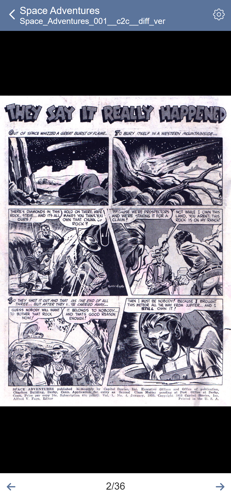
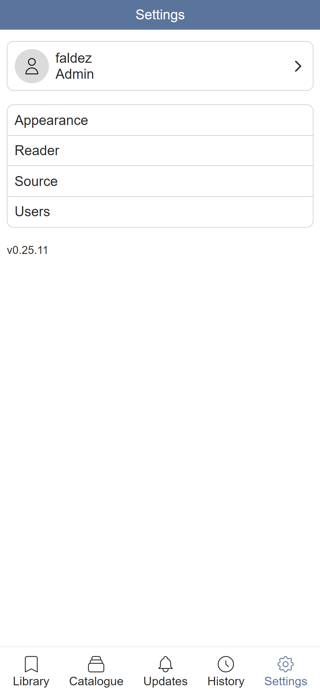

|Build|Stats|Release|Docker|Discord|
|---|---|---|---|---|
|||||[](https://discord.gg/wPSEftdDqB)|

#  Tanoshi
Selfhosted web manga reader with extensions.

## Screenshots
||||
|---|---|---|
||||

## Features
### Currently working
- Browse, search, and read manga from local, mangasee and [more](https://github.com/fadhlika/tanoshi-extensions)
- Favorite mangas
- Reading history across devices
- See chapter updates
- Read in single page, double page, or long strip
- Read from right to left or left to right
- Web reader is PWA and optimized for standalone mode on mobile
- Multi-user with admin and reader role

### Planned
My plan is to make this as close as tachiyomi features. Planned features are listed [here](https://github.com/faldez/tanoshi/issues?q=is%3Aopen+is%3Aissue+label%3Aenhancement)

Note that this project is still under heavy development, expect breaking changes on any release until hitting 1.0. 

## Installation
### Prebuilt Binary
Download and run binary from latest release, aside from plugins all dependencies are statically linked.

### Docker
```
docker create --name=tanoshi -p 8080:80 --mount type=bind,source=/path/to/data,target=/tanoshi --restart unless-stopped faldez/tanoshi
```

```
docker start tanoshi
```

### Extensions
By default tanoshi only support to read locally available manga specified in `local_path` in `config.yml`. To browse and read manga from external source, tanoshi needs extensions. Extensions can be donwnloaded from [here](https://github.com/fadhlika/tanoshi-extensions) in `repo` branch. 

You can download individual plugins and store in on your selected `plugins_path` in `config.yml`, or clone `repo` branch and copy all of plugins to `plugins_path`, or you can install from web.

### Account
On first run, tanoshi will ask you create account, then you can use the account to login. First user will always be admin, and can create new user.

## Usage
### CLI
```
tanoshi 

USAGE:
    tanoshi [FLAGS] [OPTIONS]

FLAGS:
    -h, --help            Prints help information
    -V, --version         Prints version information

OPTIONS:
        --config <config>    Path to config file
```

### Config
Tanoshi will look `config.yml` in `$TANOSHI_HOME` which defaults to `$HOME/.tanoshi` on macos and linux, `C:\Users\<username>\.tanoshi` on windows. Below is example configuration
```
# Port for tanoshi to server, default to 80
port: 3030
# Absolute path to database
database_path: /absolute/path/to/database
# JWT secret, any random value, changing this will render any active token invalid
secret: secret
# Absolute path to where plugin is stored
plugin_path: /absolute/path/to/plugins
# Absolute path to manga
local_path: /absolute/path/to/manga
```

local manga have to be structured below, it tested for `cbz` and `cbr` files
```
/path/to/manga
├─── Series 1
│   ├─── Volume 1
|   ├─── Volume 2
|   └─── ...
└─── Series 2
    ├─── Volume 1
    ├─── Volume 2
    └─── ...

```

## Feedback/Questions/Discussion
Feel free to create issue or ask in [Discord Server](https://discord.gg/wPSEftdDqB)


## Build
Tanoshi backend use [rust-embed](https://github.com/pyros2097/rust-embed) to embed static files to the binary. Because of this, `tanoshi-web` need to be built first so `tanoshi` will be able to build successfully.

### Frontend
1. Install Rust
2. Install trunk and wasm-bindgen-cli
   ```
   cargo install trunk wasm-bindgen-cli
   ```
3. Change directory into `tanoshi-web`
    ```
    cd tanoshi-web 
    ```
3. Install all npm dependencies
    ```
    trunk build
    ```

### Backend
1. Change directory into `tanoshi` or root repository
2. Install dependencies for https://github.com/faldez/libarchive-rs
3. Build
    ```
    cargo build
    ```

PS. On linux you may need to install libssl-dev on ubuntu/debian or openssl-dev on fedora/centos